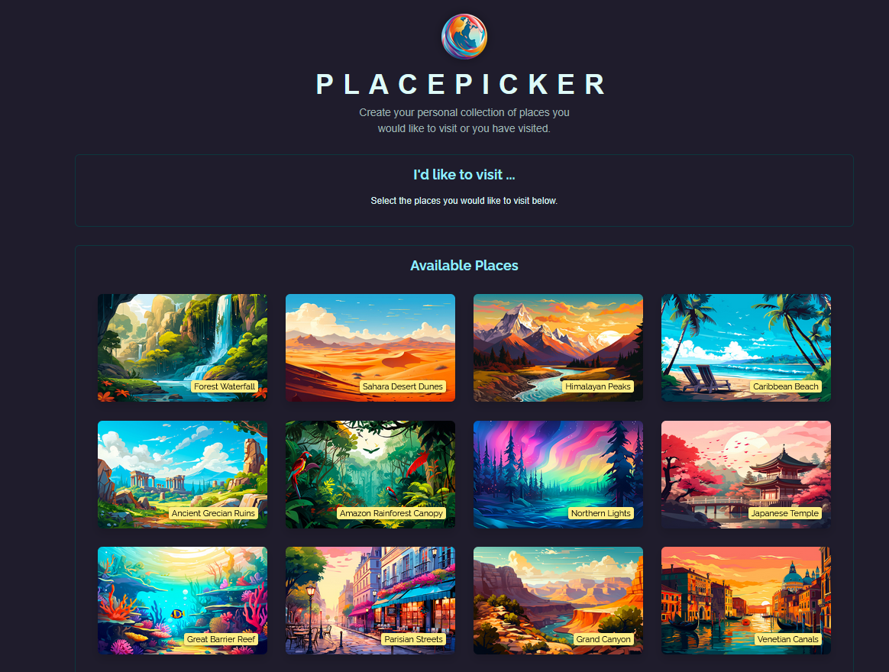
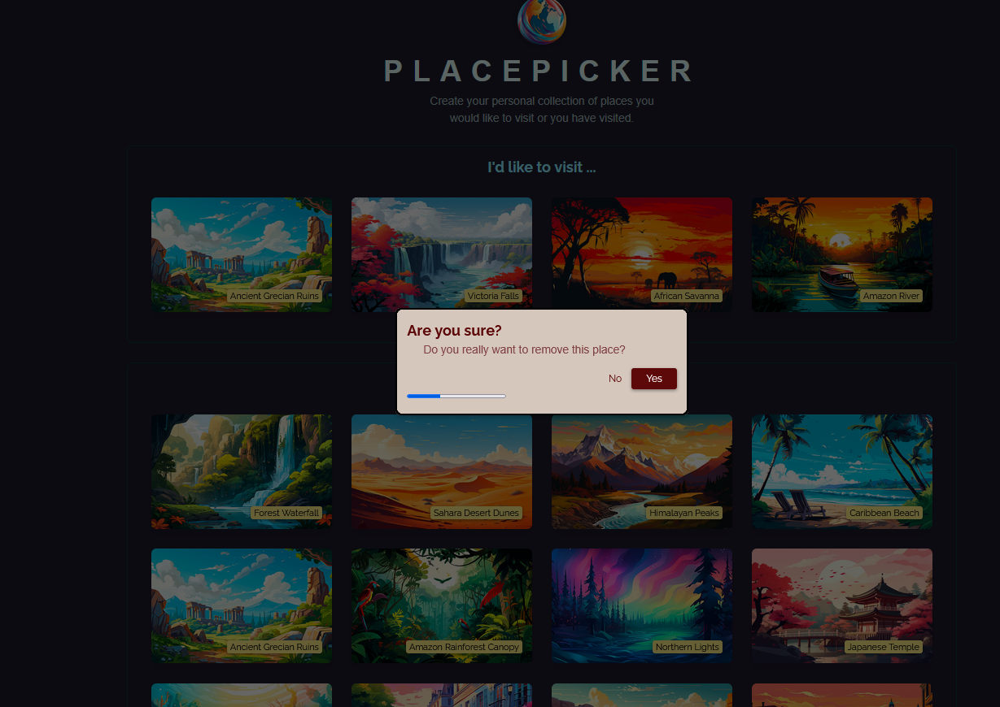

🗺️ PlacePicker(Screenshots of the app below v)

A simple React app where users can select places they'd like to visit and manage their personalized list. It demonstrates key React concepts like:

    Custom hooks (useFetch)

    Shared state

    Updating both frontend & backend

    Conditional modals and error handling

🚀 Features

    Browse a list of available places.

    Select places to add to your personal "I'd like to visit" list.

    Remove places from your list with a confirmation modal.

    Real-time frontend updates with backend synchronization.

    Graceful error handling via modals.

    🧩 Component Structure

🛠️ Getting Started
1. Clone the Repo

git clone https://github.com/your-username/place-picker.git
cd place-picker

2. Install Dependencies

npm install

3. Start the Backend (Express API)

Make sure your backend is running and serves endpoints like:

    GET /user-places

    PUT /user-places

    GET /available-places

### 1. Homepage

### 2. Selecting a Place

### 3. Delete Confirmation Modal

