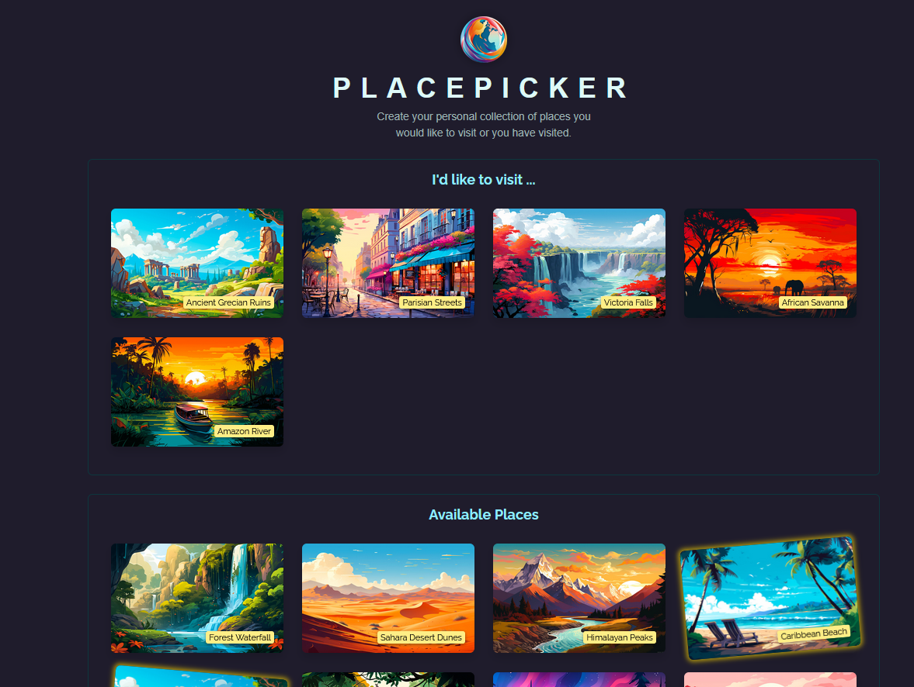

### 1. Homepage

### 2. Selecting a Place

### 3. Delete Confirmation Modal

🗺️ PlacePicker

A simple React app where users can select places they'd like to visit and manage their personalized list. It demonstrates key React concepts like:

    Custom hooks (useFetch)

    Shared state

    Updating both frontend & backend

    Conditional modals and error handling

🚀 Features

    Browse a list of available places.

    Select places to add to your personal "I'd like to visit" list.

    Remove places from your list with a confirmation modal.

    Real-time frontend updates with backend synchronization.

    Graceful error handling via modals.

    🧩 Component Structure

App.jsx
│
├── components/
│   ├── AvailablePlaces.jsx   # Shows list of selectable places
│   ├── Places.jsx            # Shared layout component for place lists
│   ├── DeleteConfirmation.jsx
│   ├── Modal.jsx
│   └── Error.jsx
│
├── hooks/
│   └── usefetch.js           # Custom data-fetching hook
│
├── http.js                   # Fetch functions (backend API calls)
├── loc.js                    # Helper for sorting by distance
├── assets/
│   └── logo.png

🛠️ Getting Started
1. Clone the Repo

git clone https://github.com/your-username/place-picker.git
cd place-picker

2. Install Dependencies

npm install

3. Start the Backend (Express API)

Make sure your backend is running and serves endpoints like:

    GET /user-places

    PUT /user-places

    GET /available-places

